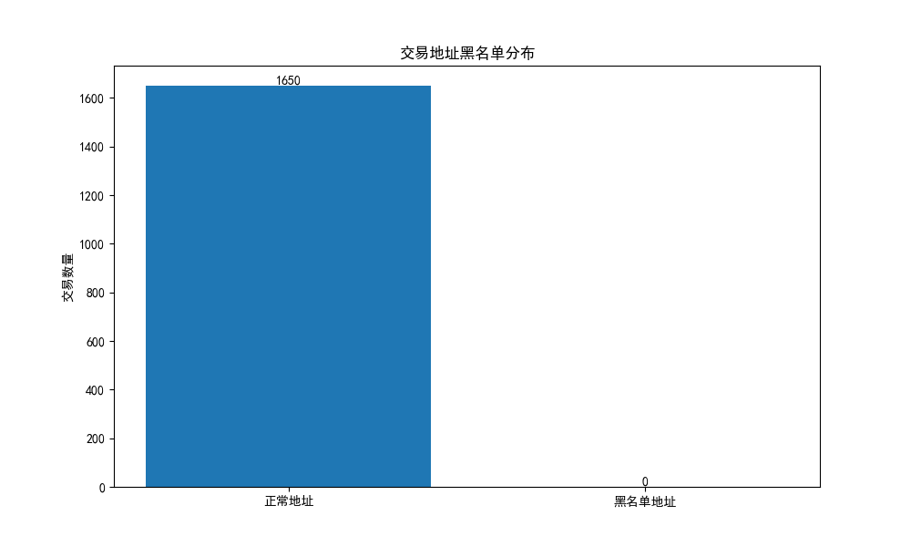
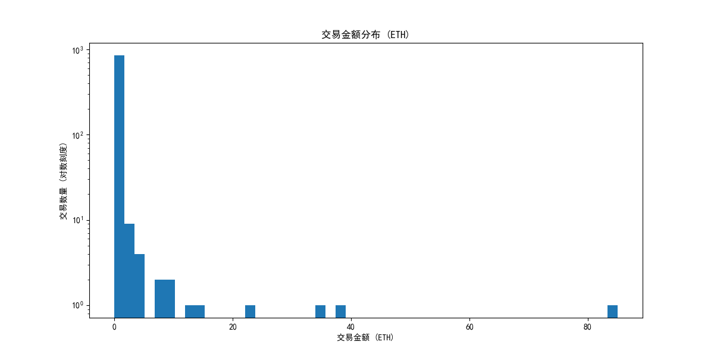

# Ethereum Transaction Network Analysis System

[English](README.md) | [中文](README_CN.md)

A Graph Neural Network (GNN) based system for detecting suspicious addresses in Ethereum transaction networks. This system identifies potentially suspicious transaction addresses by analyzing the structure and features of the Ethereum transaction network.

## Project Pipeline

### 1. Data Collection (blockchain_data.py)
- Connect to Ethereum node using Web3.py
- Fetch recent block information (default: last 10 blocks)
- Extract transaction data including:
  - Transaction hash
  - From address
  - To address
  - Transaction value
  - Block number

### 2. Blacklist Processing (blacklist_data.py)
- Fetch known suspicious addresses
- Process and standardize address formats
- Build blacklist dataset

### 3. Network Construction (network_analysis_full.py)
- Build transaction network using NetworkX
- Nodes: Transaction addresses
- Edges: Transaction relationships
- Edge weights: Transaction amounts
- Calculate network features:
  - Degree centrality: Number of connections for each node. In-degree represents incoming transactions, while out-degree represents outgoing transactions.
  - Transaction amount statistics: Track total incoming and outgoing amounts for each node.
  - Transaction frequency analysis: Monitor transaction patterns including incoming and outgoing frequencies.

### 4. GNN Model (gnn_model.py)
- Feature Engineering:
  - Node features:
    - In/Out degrees
    - Transaction amount statistics
    - Transaction frequency
  - Feature normalization
- Model Architecture:
  - 3-layer GCN
  - Hidden dimension: 64
  - Dropout: 0.5
- Training Process:
  - Early stopping (patience=20)
  - Dynamic threshold (top 10% probability)

### 5. Visualization Results

#### 5.1 Transaction Network Structure
[Interactive Network Visualization](data/visualizations/full_network.html)

This network graph shows relationships between transaction addresses:
- Red nodes: Suspicious addresses
- Blue nodes: Normal addresses
- Node size: Based on transaction frequency
- Edge thickness: Based on transaction amount
- Interactive features:
  - Zoom in/out for details
  - Drag nodes to explore connections
  - Hover to see transaction details
  - Click to highlight connected nodes

#### 5.2 Suspicion Score Heatmap


The heatmap shows the spatial distribution of suspicion scores:
- Red areas: High suspicion clusters
- Yellow areas: Medium suspicion regions
- Light areas: Low suspicion regions
- Node size reflects transaction activity

#### 5.3 Transaction Pattern Analysis


The scatter plot shows transaction behavior features:
- X-axis: In-degree (received transactions)
- Y-axis: Out-degree (sent transactions)
- Point size: Total transaction amount
- Color intensity: Suspicion level

#### 5.4 Interactive Network Explorer
An interactive network exploration tool (data/visualizations/draggable_network.html):
- Zoom in/out support
- Draggable nodes
- Hover information:
  - Address
  - Transaction frequency
  - Number of counterparties
  - Total transaction amount
- Click to highlight connections

## Installation and Usage

1. Install dependencies:
```bash
pip install -r requirements.txt
```

2. Configure environment variables:
```python
# config.py
INFURA_PROJECT_ID = "your_infura_project_id"
INFURA_URL = f"https://mainnet.infura.io/v3/{INFURA_PROJECT_ID}"
BLACKLIST_API_URL = "blacklist_api_url"
```

3. Run analysis:
```bash
python main.py
```

## Project Files

- `blockchain_data.py`: Ethereum blockchain data fetcher
- `blacklist_data.py`: Blacklist address processor
- `data_processor.py`: Data preprocessing and normalization
- `network_analysis.py`: Basic network analysis functions
- `network_analysis_full.py`: Complete network analysis implementation
- `gnn_model.py`: GNN model definition and training
- `config.py`: Configuration file
- `main.py`: Main program entry
- `requirements.txt`: Project dependencies
- `logs/`: Log file directory

## Output Results

The system generates analysis reports in the `logs` directory, including:
1. Training Process
   - Loss values per epoch
   - Early stopping information
   - Model accuracy

2. Suspicious Address Analysis
   - Address information
   - Suspicion scores
   - Transaction statistics (in/out degrees)
   - Amount statistics (total incoming/outgoing)

## Notes

1. Data Collection
   - Requires valid Infura API key
   - Local caching recommended to reduce API calls

2. Performance Optimization
   - Large-scale network analysis can be time-consuming
   - GPU acceleration recommended (if available)

3. Parameter Tuning
   - Model parameters can be adjusted based on actual data
   - Suspicion threshold defaults to top 10%

